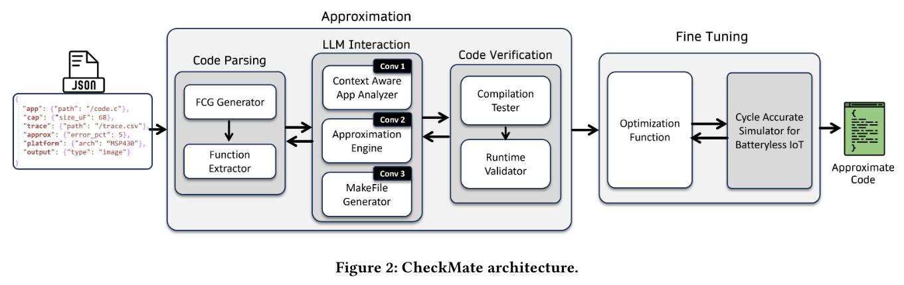

<p align="center">
  
</p>

# **CheckMate: LLM-Powered Approximate Intermittent Computing**

CheckMate is a framework designed to automate the application of software-level approximate computing techniques for intermittent computing applications. It leverages Large Language Models (LLMs), in conjunction with tools such as `egypt` and `clangd`, to analyze and suggest code approximations using a context-aware and comprehensive prompting pipeline robust against erroneous code generated by LLMs. CheckMate further tunes approximations to the application's deployment environment by simulating runtime power consumption using a modified version of the `fused` simulator. For a comprehensive overview, refer to [our CheckMate paper](https://arxiv.org/pdf/2411.17732).

---
## Directory Structure

| Directory | Content |
| --------- | ------- |
| config | Contains files with global variables that control the execution of CheckMate (can be altered to skip/change/add steps in the CheckMate pipeline). |
| eval-app | This folder contains the evaluation apps that CheckMate has been tested on (results of these evaluations are present in our paper cited above). |
| fusedBin | Contains the configuration files of the fused simulator. The fused executable file must also be placed in this directory once it has been built and compiled (see Setup section for more details). |
| lib | Contains scripts used to invoke various tools utilized by CheckMate. |
| logs | This folder will contain any temporary files created during CheckMate's execution. |
| prompts | Contains text files that are used as prompt templates when invoking the LLM. |
| traces | Contains sample energy traces that CheckMate can use when simulating power consumption on the fused simulator. |
| utils | Contains scripts with various utility functions used by CheckMate during its execution. |

---

## CheckMate Workflow

CheckMate's workflow can be divided into two main parts:

1. Analysis and Approximation
2. Fine Tuning

The master script where the execution of each process can be observed is the `main.py` file. This is the primary script that links all the different components of CheckMate into one pipeline. To understand the workflow at a code level, follow the steps outlined in the `main.py` file (a "README FOLLOW ALONG START HERE" comment has been included for readers).


#### 1. Analysis and Approximation

We begin by creating the Function Call Graph (FCG) of the application. The FCG is constructed by creating `.expanded` files using `gcc`, which are then fed into the `egypt` tool to generate a graphical representation file that can be read by `graphviz`. However, since we don't require a graphical representation, we parse the file and instead construct an adjacency matrix of the FCG. This occurs in the `lib/llm.py` and `lib/pdf.py` files when they are imported into the `main.py` file. The LLM is given the files in the target directory and asked to create a Makefile that outputs the `.expanded` files for the application.

We then use Microsoft's Language Server Protocol (LSP) to extract all the functions in the target files. The main function calls the `parseFunctions()` function, which initializes an instance of LSP. It then sends a documentSymbol request for each `.c` file in the target folder, returning a JSON object that lists all the function names along with the line and character positions where each function's definition starts and ends. We parse the `.c` files to extract all the function definitions and store them in JSON files located in the `functions` folder (this folder is created at runtime and is temporary).

Next, we proceed to the LLM interaction steps, beginning with application analysis (`findTargetFunctions` function). Here, we start by asking the LLM to analyze the functions and select which ones can be approximated. Simultaneously, we ask it to generate summaries of the functions (these summaries help the LLM analyze the purpose of the functions, utilizing the benefits of chain-of-thought (CoT) prompting). We then proceed to the approximation engine pipeline, iterating over each function in sequential order to first plan the approximations to implement and then implement them (see `planStepFunction` and `approximateFunction` functions in `lib/llm.py`). In this final step, knob variables are also added (see our [paper](https://arxiv.org/pdf/2411.17732) for more information on knob variables). For each step in this sequence, the exact prompts can be found in the `prompts` folder.

Lastly, for each modified (approximated) function, we validate the approximation’s compile-time and runtime correctness using a Makefile generated by the LLM.

#### 2. Fine Tuning

Now that we have a set of approximated functions, we can tune their knobs to discard poor approximations by "tuning them out" (setting knob values such that they have minimal effect on application runtime) and enhance approximations advantageous for our use case. Here, we use user-provided energy traces (see the `traces` folder for examples) and sample inputs to evaluate the power-cycle and program output degradation. A modified version of the [Fused](https://github.com/UoS-EEC/fused) simulator is used to evaluate the number of power cycles required for program execution (see `checkpointOrchestration` function).

To tune the knobs, scikit-optimize's implementation of Bayesian Optimization is employed to effectively find the best possible knob combinations (see `runBayesOpt` function in `lib/bo.py`).

---
## Setup without Docker

### **1. Install `egypt`**
`egypt` generates call graphs for C programs. Follow these steps to install it:

1. Download `egypt` from [this link](https://www.gson.org/egypt/).
2. Extract the downloaded tar file and navigate to the extracted folder:
   ```bash
   tar -xvf egypt.tar.gz
   cd egypt
   ```
3. Run the following commands to install:
   ```bash
   sudo apt install perl
   sudo apt install graphviz
   perl Makefile.PL
   make
   sudo make install
   ```
4. Verify installation:
   ```bash
   man egypt
   ```

### **2. Install `clangd`**
`clangd` is typically pre-installed on Linux distributions. To check:
```bash
clangd --version
```
If not installed, run:
```bash
sudo apt install clangd
```

### **3. Install and Build `fused-checkmate`**

The `fused` simulator is used to evaluate the performance of intermittent computing applications. To set up:

1. Clone the `fused-checkmate` repository:
   ```bash
   git clone https://github.com/rafayy769/fused-checkmate.git
   ```
2. Use the provided bash script to build and install:
   ```bash
   bash install_fused_script.sh
   ```
3. Once built, copy the `fused` binary from the `build` directory in the cloned repository to the `fusedBin` folder in the CheckMate repository.

### **4. Set Up the `.env` File**
Create a `.env` file in the root directory of CheckMate with the following configurations, depending on your preferred LLM API:

- For OpenAI's API:
  ```plaintext
  OPENAI_API_KEY="YOUR-API-KEY"
  LLM_MODEL="gpt-4o"
  ```
- For Anthropic's API:
  ```plaintext
  ANTHROPIC_API_KEY="YOUR-API-KEY"
  LLM_MODEL="claude-3-5-sonnet-latest"
  ```

### **5. Install Python Dependencies**

1. Create a virtual environment (optional but recommended):
   ```bash
   python3 -m venv checkmate_env
   source checkmate_env/bin/activate
   ```
2. Install dependencies from the `requirements.txt` file:
   ```bash
   pip install -r requirements.txt
   ```

---
## Setup with Docker

Follow the steps below to build and use the Docker container interactively:

*Note: For you own ease make sure you have setup the .env file before these steps though it is not necessary.*

1. **Build the Docker Image**  
   Open a terminal in the root directory of your project (where the Dockerfile is located) and run:
   ```bash
   docker build -t checkmate-image .
   ```
   This will create a Docker image named `checkmate-image`.

2. **Run the Docker Container Interactively**  
   To start the container and access a terminal within it, use the following command:
   ```bash
   docker run -it checkmate-image
   ```
   The `-it` flag ensures the container runs in interactive mode, providing you with a terminal.

3. **Verify Internet Connectivity**  
   To confirm the container has internet access, you can test connectivity with commands such as:
   ```bash
   ping google.com
   ```
   
--- 
## **Usage**

1. **Configure the Tool:**
   - Place your **API key** and **model name** in the `.env` file.
   - Place the application to be approximated (along with its required compilation files) in the `target` folder.
   - If using a checkpointing library other than `iclib ManageState`, include the necessary library files in the `target` folder as well (to be added).

2. **Define Inputs:**
   - Fill in the `error class` and `energy trace` variables in the `inputs.yml` file (to be added).

3. **Note:** 
   - The recommended LLM snapshot is `gpt-4o-2024-11-20`, as it has undergone the most testing and provides stable performance.

---

### **Additional Notes**

- Ensure that all dependencies, especially `clangd` and `egypt`, are installed correctly before proceeding with application analysis.
- Use of a virtual environment is highly encouraged to prevent conflicts with global Python installations.
- Copy Files to a Running Container : 
     Use the `docker cp` command to copy files from your host system into a running container:
     ```bash
     docker cp /path/to/local/file <container_id>:/path/in/container
     ```
     Example:
     ```bash
     docker cp my_script.py <container_id>:/home/ubuntu/CheckMate/scripts/
     ```


## Citing CheckMate 
Abdur-Rahman Ibrahim Sayyid-Ali, Abdul Rafay, Muhammad Abdullah Soomro, Muhammad Hamad Alizai, Naveed Anwar Bhatti. LLM-Powered Approximate Intermittent Computing, 2024

```bibtex
@inproceedings{Ali2024CheckMate,
  title={{CheckMate}: Extracting Permission-protected Private Information from Smartphone Voice Assistant using Zero-Permission Sensors,
  author={Sayyid-Ali, Abdur-Rahman Ibrahim and Rafay, Abdul and Soomro, Muhammad Abdullah and Alizai, Muhammad Hamad and Bhatti, Naveed Anwar},
  year={2024},
  booktitle={arXiv},
}
```
